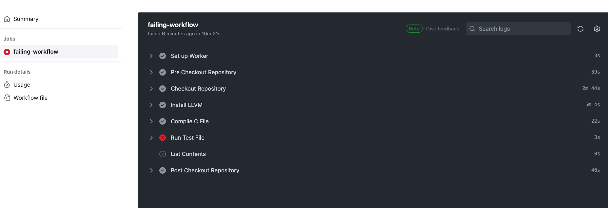
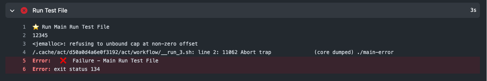
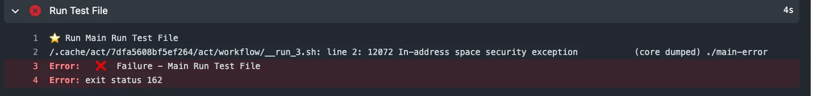
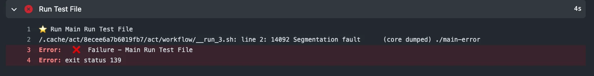

# Failed build examples

This documentation assumes you have gone through examples in:
[Create an example workflow of compiling/testing](./example-workflow-compiling-and-testing.md)

Examples in this documentation will be written in C and the following workflows are expected to fail.

## Example 1: attempting to write beyond the bounds of the allocated memory

You can either create a new file or if you can add the following code to your `main.c` file, in the following examples we will be adding code to `main.c`.

Update your `main.c` file like this:

```
#include <stdio.h>
#include "functions.h"
#include <stdlib.h>
#include <string.h>


//failing jemalloc

int jemallocError(void) {
    char* buf = malloc(4);
  strcpy(buf, "abcdsadasdasd");
    buf += 4;
    strcpy(buf, "12345");
    printf("%s\n", buf);

    free(buf); // expected to fail here
    return 0;
}

int main(void)
{
    printf("try to print jemalloc error: %d\n", jemallocError());

    return 0;
}
```

Next we will create a new workflow in `./github/workflows` called `myfailingworkflow.yaml` and populate it with:

```
name: myFailingWorkflow
on:
  push:

jobs:
  failing-workflow:
    runs-on: cheribsd-23.11
    steps:
      - name: Checkout Repository
        uses: actions/checkout@v2

      - name: Install LLVM
        run: pkg64 install -y llvm-base

      - name: Compile C File
        run: |
          cc -Wall -o main-error  src/main.c

      - name: Run Test File
        run: ./main-error

      - name: List Contents
        run: ls -al .

```

Once you have made your changes save them and push. A runner should pick up the changes on github and you can see it under your Repository > Actions > Workflows > the latest run of your `myFailingWorkflow` > click into the Job and you should see sth like this:


Expand the `Run Test File` section to see your error message:

What is happening in our `jemallocError` function is this:
Function jemallocError attempts to allocate memory for a buffer of size 4 bytes using `malloc`, then copies the string `"abcdsadasdasd"` into that buffer. After that, it increments the buf pointer by 4 bytes, effectively moving it past the allocated memory. This is followed by another attempt to copy the string `"12345"` into the buffer.

The reason this code fails is that it is attempting to write beyond the bounds of the allocated memory. When you increment buf by 4 bytes, it moves the pointer past the allocated memory block. Then, when you call `free(buf)`, you are attempting to free memory that was not allocated by malloc, as buf has been modified.

## Example 2: buffer overflow

In this example we will attempt to allocate certain size of a memory to a buffer, but then we will attempt to store information requiring larger amount of memory allocated.

Update your `main.c` to this:

```
#include <stdio.h>
#include "functions.h"
#include <stdlib.h>
#include <string.h>


//buffer overflow example

void bufferOverflowDemo() {
    // Allocate memory for a buffer of size 10
    char *buffer = (char *)malloc(10 * sizeof(char));

    if (buffer == NULL) {
        printf("Memory allocation failed\n");
        return;
    }

    // Attempt to copy a string larger than the allocated buffer
    strcpy(buffer, "This is a longer string than the allocated buffer size");

    // Print the buffer
    printf("Buffer content: %s\n", buffer);

    // Free the allocated memory
    free(buffer);
}

int main(void)
{
    bufferOverflowDemo();

    return 0;
}
```

You needn’t make any changes in your `myfailingworkflow.yaml`. Push your changes and observe in your `Actions` the latest `job`. as previously, this should fail at the `Run Test File` step. Expand this step to observe the error message. It should look like so:


## Example 3: attempting to call attacker-controlled memory address

modify your `main.c` file like so:

```
#include <stdio.h>
#include "functions.h"
#include <stdlib.h>
#include <string.h>


int codeInjectionExample(){

    void (*func_ptr)() = (void (*)())0x12345678; // some random address

    // Attempting to execute code from a random address
    func_ptr();

    return 0;

}

int main(void)
{
    codeInjectionExample();

    return 0;
}
```

Save, commit and push and you should see an error like so:


If we wanted to make sure that a called function originates from an authorised memory region, we need to make sure the function comes from within our program.

for example:

```
#include <stdio.h>
#include "functions.h"
#include <stdlib.h>
#include <string.h>

void authorized_function() {
    printf("This is an authorized function.\n");
}

int codeInjectionExample(){

    // Define a function pointer and initialize it to point to the authorized function
    void (*func_ptr)() = &authorized_function;

    // Call the authorized function using the function pointer
    func_ptr();

    return 0;

}

int main(void)
{
    codeInjectionExample();

    return 0;
}
```
