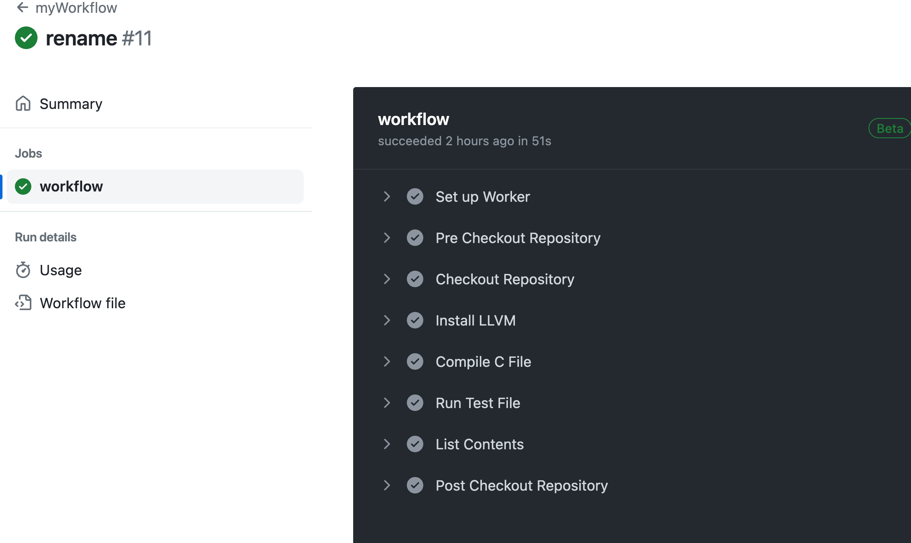

## Application and joining the org

You will have to apply to join the dc-dsbd-test org. To do that please send an email to dsbdprogramme@digicatapult.org.uk

In the email please include your name, the name of the org you want to join (dc-dsbd-test) and most importantly your github username and what you want to call your repository (the repository will be set up for you).

You will then be invited to join the org (you should receive an email notifying you of this. NOTE: the email will be sent to the email address connected to the github username you provided)

Once you accept the invitation and you are now part of the dc-dsbd-test org you can proceed with the next steps.

## Creating a repository and a test workflow

Now that you have access to the org you can navigate to Repositories you should see your repository there. (You will be able to see other example repos under this organisation, however you will not be able to edit those.)

Once you have located your repo you can clone it and on your machine we will add a test workflow.

In your cloned repo create .github/workflows directories and in it create a test.yaml file. Populate this file with the following.

```
name: Demo
on:
  push:

jobs:
  test:
    runs-on: cheribsd-23.11
    steps:
      - run: |
          cheribsdtest-purecap-benchmark -a
      - run: ls -al .
```

NOTE: we are basically replicating the test-repo setup

Please save, commit and push this change.

Once you have done that, it will trigger a runner. Because you are using runners hosted by the organisation, these will be always up and will pick up jobs as they come.

If this is not run automatically (e.g. if you have chosen for it not to run on push) you can navigate to your Repository > Actions > Workflows (on the left hand side) choose the Demo workflow and on the right hand side you should see the various workflow runs. You can click on the top one and then select to re-run jobs in the right hand corner. (You can re-run jobs as many times as you want)

Provided the test.yaml workflow runs successfully you can proceed onto creating your own workflows.

More complex workflow
Example: actually executing a file in a github workflow

Lets assume you have a src directory in you project with a file called get-pointer.c with some simple C code ([For Inspiration][ctsrd-cheri]).

We will add a new workflow under .github/workflows called myworkflow.yaml with body:

NOTE: There are 3 stages in our workflow. Installing packages, compiling and execution of the binary.

```
name: myWorkflow
on:
  push:

jobs:
  workflow:
    runs-on: cheribsd-23.11
    steps:
      - name: Checkout Repository
        uses: actions/checkout@v2

      - name: Install LLVM
        run: pkg64 install -y llvm-base

      - name: Compile C File
        run: |
          cc -Wall -o get-pointer src/get-pointer.c

      - name: Run Test File
        run: ./get-pointer

      - name: List Contents
        run: ls -al .
```

We need to install LLVM first by doing pkg64 install -y llvm-base (With regards to packages: the repository that we're using is [pkg.cheribsd.org][pkg.cheribsd.org]. We have several options for ABIs to compile against, but in this case we want to be using the hybrid ABI. The most relevant list is therefore: [CheriBSD packages: CheriBSD:20230804:aarch64][CheriBSD packages: CheriBSD:20230804:aarch64])

Then we compile our get-pointer.c file cc -Wall -o get-pointer src/get-pointer.c (The format for this command is: cc -g -Wall -o BINARY_NAME FILE_NAME.c so we are providing output binary name)

Then we execute the binary: ./get-pointer

Once you are happy with your example code and workflow, save, commit and push to github.

This will be automatically picked up and ran by a runner, if you have not chosen to run your workflow on push or you would like to re-run a job, you will need to choose to run it yourself. As above, navigate to your Repository on github > Actions > Workflows > Select your workflow, click on the newest workflow run and choose to re-run jobs. This will be picked up by runner and ran.

Once the workflow finishes you can click on the job and inspect the different stages by clicking the expand arrow next to each step.


## Further workflow experimentation

If your code requires further packages - these also need to be installed in the workflow (after installing LLVM and pre-compilation) You would effectively add an additional step:

```
  - name: Install Check
    run: pkg64 install -y check
```

if you want to see information about your installed package you can do so by adding this step to a workflow:

```
- name: Find where check is installed
        run: pkg64 info check
```

If you are compiling in a workflow and you have installed additional packages include flag -I*dir*

```
  - name: Build binary
    run: |
      cc -g -Wall -o OUTPUT_BINARY  -I"/usr/local64/include"  FILE_TO_COMPILE
```

NOTE: if your FILE_TO_COMPILE is making use of other C files you may need to include those in this command as well

## The differences between pkg/pkg64/pkg64c/pkg64cb

We have several options for ABIs to compile against, but in this tutorial we are using the hybrid ABI. The most relevant list is therefore: [CheriBSD packages: CheriBSD:20230804:aarch64][CheriBSD packages: CheriBSD:20230804:aarch64]

Various package lists can be found here: [CheriBSD packages][pkg.cheribsd.org]

pkg - is standard FreeBSD package manager

pkg64 - for hybrid ABI packages

pkg64c - for CheriABI package

pkg64cb - package manager for benchmark ABI

Built packages are registered in separate package repositories that can be managed with separate package managers: pkg64c for CheriABI packages, and pkg64 for hybrid ABI packages. pkg64c and pkg64 are programs compiled for the same ABI as packages they manage, they use separate package repository configuration directories, databases and caches. In short, the package managers are completely unaware of each other. (Source [here][package-difference] page 15)

<!-- Links -->

[ctsrd-cheri]: https://ctsrd-cheri.github.io/cheri-exercises/exercises/compile-and-run/index.html
[pkg.cheribsd.org]: https://pkg.cheribsd.org/
[CheriBSD packages: CheriBSD:20230804:aarch64]: https://pkg.cheribsd.org/CheriBSD:20230804:aarch64.html
[package-difference]: https://freebsdfoundation.org/wp-content/uploads/2023/05/a66452da2b483e5e92bde6533b7236c4d11382eb-1.pdf
